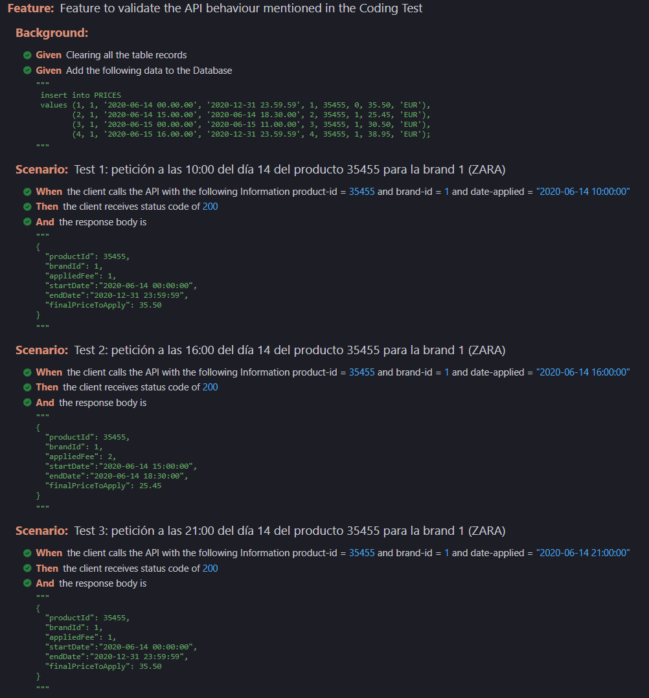
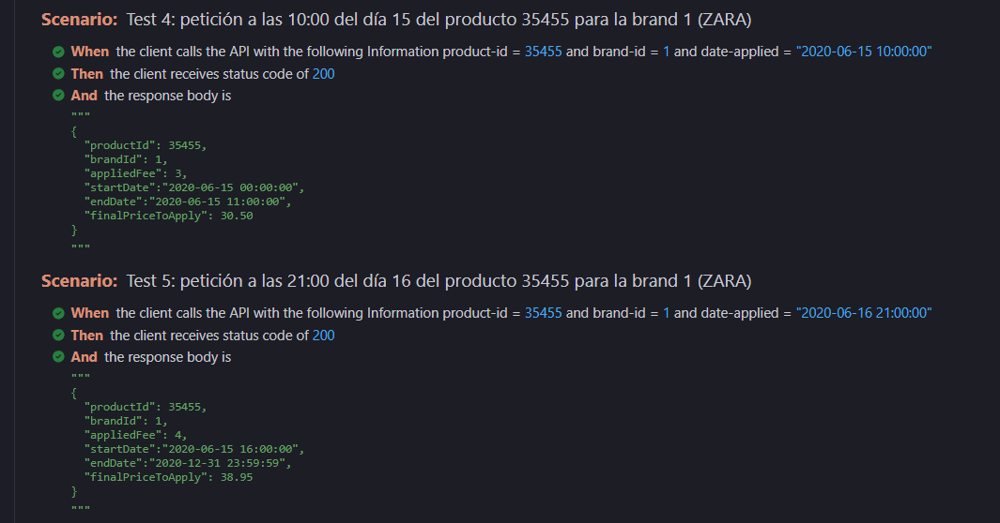

## Diseño y construcción del servicio.

* Para la organización del código se usa **arquitectura hexagonal.**
* Como gestor de versiones de base de datos, he optado por **Flyway**, de esta forma puedo recrearla durante los Tests
* Un módulo de test Unitarios y otro de Tests de Integración
* Gherkin usando BDD para desarrollar los Tests solicitados en la prueba
* Quería probar el nuevo módulo de Spring JdbcClient https://spring.io/blog/2023/11/23/spring-boot-3-2-0-available-now en lugar de usar las típicas Interfaces de JPA
* En los Tests de Integración también he usado el **Nuevo RestClient**
* Swagger en la API y un Controller Advice como gestor de errores
* MapStruct como Mapper entre la Capa Rest y el Domninio
* Aprovechando Java  21, he usado Text Blocks, Records y virtual Threads

## Calidad de Código.

Intentando respetar SOLID, usando arquitectura hexagonal.

Mucho enfasis en los Tests:

 * Para los tests de Repositorio, he optado por usar @DataJpaTest https://docs.spring.io/spring-boot/docs/current/api/org/springframework/boot/test/autoconfigure/orm/jpa/DataJpaTest.html
 * Para los tests REST, he optado por usar @WebMvcTest https://docs.spring.io/spring-boot/docs/current/api/org/springframework/boot/test/autoconfigure/web/servlet/WebMvcTest.html
 * Para Los tests de Integración BDD con Cucumber [Cucumber: BDD Testing & Collaboration Tools for Teams](https://cucumber.io/)

## Resultados correctos en los test.

Adjunto [Reporte](./report.html) de Cucumber como prueba

* 
* 

